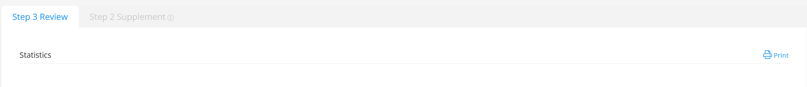
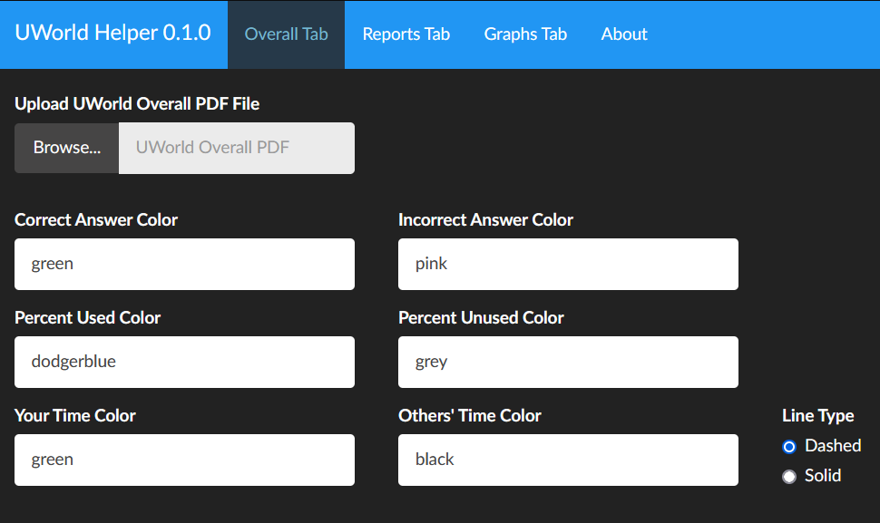
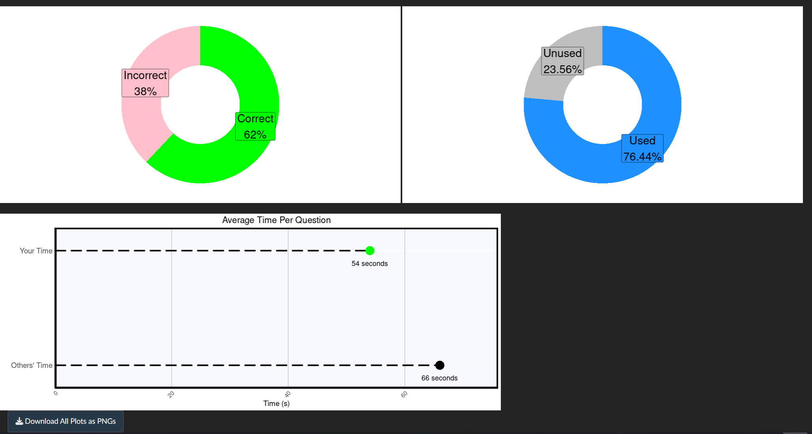
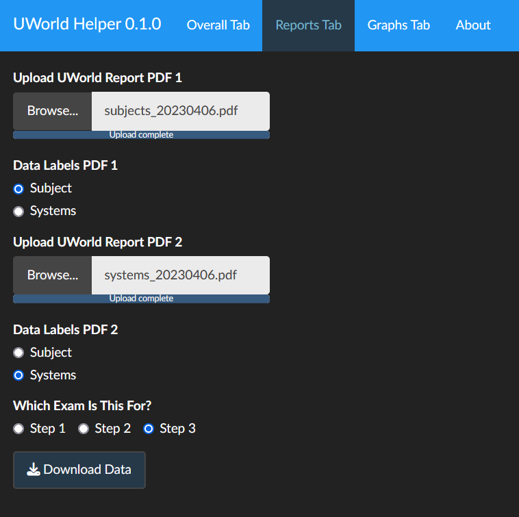
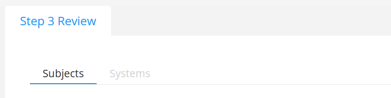
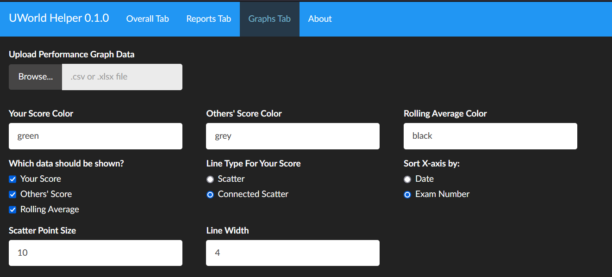
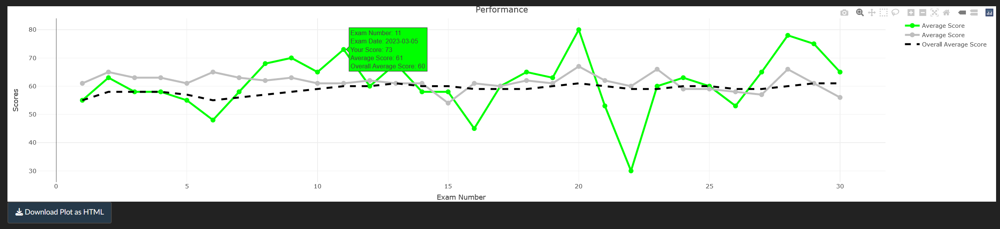

UWorldHelper
================
MarioBeamer
2023-04-12

## Introduction

[Find the app here!](https://mariobeamer.shinyapps.io/UWorldHelper/)

For reasons that remain unclear, UWorld does not make your performance
data available as csv, text, or any other usable format. The only way to
get your data is to “print” it to a PDF. This made me unreasonably salty
(I’m not joking, I even emailed them about this). Also, and perhaps most
importantly, I didn’t want to study anymore. So I made this web app to
convert the PDFs under the “Reports” tab of UWorld into csv files. Then
I decided I could *also* remake the plots on the “Overall” and “Graphs”
tabs, but add a little but more user customization to them. So I did.
Maybe someone other than me will find this useful.

## Organization and Features

I’ve laid the app out to be similar to the UWorld page, just so things
flow better. So, essentially, the app has 3 tabs: Overall, Reports, and
Graphs. You can convert your “Reports” PDFs to csv, and you can
reproduce and customize the plots from the “Overall” and “Graphs” tabs.

## How to Use the App

For starters, you’ll want to download the PDFs from the “Overall” and
“Reports” tabs. This can be found in the upper righthand corner of each
page.

Just click “print,” then choose “Save to PDF” as your Destination.

### Overall Tab

The app opens to this tab by default, since it’s also the first in the
UWorld menu. The page will look something like this:

All you have to do is upload the PDF provided by UWorld, and the app
will generate the 2 donut plots (Percent Correct and Percent of Qbank
used), as will as make a line plot for the Average Time it took you and
others and answer a question.

The colors of the donuts, as well as the colors of the dots on the
lollipop plot, are customizable. You can either enter a color name from
[the wide array of R colors](https://rpubs.com/kylewbrown/r-colors), or
you can enter a hexcode. Additionally, you can choose to make the line
from the lollipop plot of Average Time dashed or solid.

Once things are how you like them, you can click the “Download All Plots
as PNGs” button to… well, download all the plots as pngs.

### Reports Tab

The one that started it all - the Reports Tab.

Keep in mind there are actually *two* files you’ll want from UWorld
here: 1 from the “Subjects” option, and one from the “Systems” option in
UWorld.

You’ll want to upload both a Subjects and a Systems PDF. Once you’ve
done that, just click the “Download Data” button, and the app will
convert them to csv (which can opened in Excel) and download them.
Unfortunately, the titles of all the sections and subsections may be
garbled (more on this under the section [Caveats to File
Conversion](https://github.com/MarioBeamer/UWorldHelper/#caveats-to-file-conversion)).
However, the actual data should be largely correct.

### Graphs Tab

Unfortunately, UWorld doesn’t seem to provide a way to directly get this
data, so you’ll have to transcribe it into an Excel file or csv file.
Either should work! However, the file *does* need to be in the following
format:

-   Column 1 = test date
-   Column 2 = test number (i.e. if you have made 25 tests, this should
    be numbers 1-25)
-   Column 3 = your score
-   Column 4 = average score
-   Column 5 = rolling average/cumulative average

The scores can be collected by hovering over each dot on the plot
generated by UWorld under the “Graphs” tab. Not very elegant, but it’s
what we’re given.

In any case, below you can see what the Graphs Tab looks like:

The plot is fairly customizable. The top row of color options will
change the colors, again taking any named color recognized by R or any
hex value. The tick boxes allow you to choose which of the 3 types of
data provided (your scores, average scores, and rolling average) are
displayed on the plot. The “Line Type for Your Score” essentially
toggles Your Score between a scatterplot (the default used by UWorld) or
a scatter + line plot (my personal preference and the default in the
app). The “Sort X Axis by” options will order the data based on the date
you took the exams, or the order in which you took the exams. The last 2
options let you change the size of the scatter points and width of the
lines.

Ultimately, you will get an interactive plot as seen below:

Once the plot is to your liking, you can click the “Download Plot as
HTML” button to download the plot. This will, as the button suggests,
download the HTML of the plot, which maintains the interactive nature of
it and can be opened by an internet browser (just double click and your
default browser should handle it). Once you open the HTML, you should
see a button in the upper right that lets you save a static image of the
plot as a png, if that’s what you’re looking for.

### Caveats to File Conversion

At this point, I need to explain a current issue with parsing the PDFs
generated by UWorld. If you’re not interested in technical whatever, the
TL;DR is this:

1.  The sections/subsection labels of the data are often going to be a
    bunch of nonsense and incorrect
2.  The *actual data* will be correct, e.g. if the sections were
    “Airplane Wings” and “Bus Tires,” the sections may end up just being
    called “Wings” and “Tires.” The order of the data, and the data
    itself, is correct. The labels are just off.

As a longer explanation…

UWorld, again, for whatever reason, doesn’t actually produce “tables” of
data that are more easily machine readable. It’s essentially a raw PDF
that they’ve organized to kind of look like a table. Because of this, we
essentially have to read in the PDF line by line, which leads to longer
section titles getting split up and garbled in with the data. Further,
UWorld seems to dynamically generate these PDF reports. For example, if
you’ve only done 40% of a QBank and download the PDF, UWorld will not
have sections/subsections with 0 questions answered – they will just
simply not include that section/subsection in the report at all. Between
the total unpredictability of this and the nature of how we have to read
in the PDFs, I’ve had to (shamefully) *hard code* the names of all the
sections. Given that, at the time of writing, I have completed between
75-80% of UWorld for Step 3, this means a couple things:

1.  I only have labels for Step 3, and it’s possible these labels are
    incomplete since I haven’t completed 100% of the possible questions
2.  I have no labels for Step 1 or Step 2 exams

As I mentioned above, the actual parsing and organizing of the numerical
data will still be correct. However, you’ll have to manually insert all
those labels, which is less than ideal. Which brings me to…

### Looking for Help!

I’m basically looking for help in the following ways, if anyone is
interested:

1.  Send me screenshots of all the sections and subsections from 100%
    complete Question Banks from Step 1, 2, and 3. This way, at least
    people who have completed the question banks (or at least most of
    it) can have labels correctly inserted.

2.  If you’re super bored and want to try to big brain this problem and
    dynamically track labels, feel free to reach out to collaborate.
